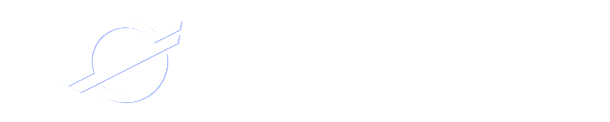

# AirdropDAO - Account Abstraction Wallet for Airdrop

## Summary
Airdrop DAO will onboard next 1 billion people.
We realize super easy UX to have Wallet.
We send Account Abstraction Wallet when user authorized some social account,

Presentation  movie:
https://youtu.be/vswHQAz6oKg

Only demo(movie):
https://www.loom.com/share/a97bf1139a2942a7965a9acdc448a35b

## Problem

It is very difficult to start crypto for web2 users.

- If you become interested in crypto, you need to set up MetaMask.
- You need to acquire tokens on a CEX and transfer them to your wallet.
- You need to connect your wallet and sign in on Dapps.

## Solution

- Easy login using Google authentication or similar methods
- Transactions without the need for gas fees
- A situation where there is no need to manage private keys

### Architecture

- By using Google Auth for login, we automatically provide users with an Account Abstraction Wallet, making it easy to obtain a wallet. Users can acquire NFTs and FTs with a single click, even if they don't have a wallet.
- During this process, users don't have to pay gas fees due to gasless transactions, and since the tokens have gone through a community audit, there is less concern about receiving scam tokens.
- Companies that want to expand their community can propose detailed information about airdrop in a proposal, which will help them learn whether a token airdrop is feasible or not.

### Unique Point

AirdropDAO can onboard web2 users who doesn't have crypto wallet yet.
the airdropped token is selected by community, using UMA,snapshot voting,called oSnap.

## User Flow

１. Visit website.
２. Authenticate some social
３. Push mint button to get some FT or NFT

## Future Work
1.Realize sybil attack resistance, selecting some ID solution.
2.We will start advertisement function for the company that want to sell some product and for users that want to trade without paying gas.
3.Find ecosystem partners.

## TechStack

| Title | Usage |
| --- | --- |
| Account Abstraction |  To provide users with a no-cost gas experience |
| Airstack | To obtain past Mint information and provide a safe and secure experience for users |
| UMA |  To implement a campaign to Giveaway safer and more secure NFTs through consensus on the use of OnSnap. |
| SnapShot |  Same as above |
| OpenAI |  To produce a unique and interesting NFT |
| Hardhat |  To implement the contract productively |
| Web3Auth |  To provide a smooth experience by not requiring users to have a private key through social authentication |

## Deployed contract

### Polygon

| contract | contract address |
| --- | --- |
| ERC721 | 0x981116f806898F1C1eCB1d3BF2AF4f2140B1BB92 |

### VotingSynstem

| contract | contract address |
| --- | --- |
| SnapShot(OnSnap) | https://demo.snapshot.org/#/libdefi.eth/proposal/0xa8f965308af64f33e300cc7091171e36d12ab726bc5455ae2d02cd8ad4c3daa9 |
| UMA | https://goerli.etherscan.io/address/0xDAd843F42Ad405c44c1D9B17f530CB1a6Cbdabf0  |

## Others

### The repo of Generative AI NFT
https://github.com/AAAirdropper/ETHGlobalTokyoNFT
